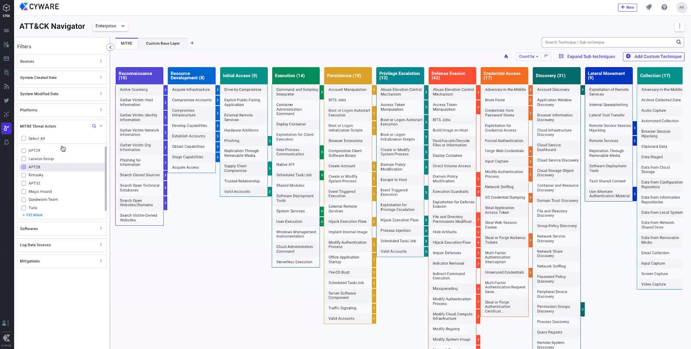

# Dashboard Front End Task

## Requirements:

1. Write code to render a dashboard the same like the one in the image below.



2. Create a node.js server to serve json data to client. [Link to the server repo](https://github.com/islamCodehood/dashboard-server).

## Extra Requirements:

1. Add Interactions to different UI components like buttons, filters, checkboxes, and user menu.
2. Create another route to serve a second view when switching between views using tabs [Mitre, and Custom Base Layer].


## Stack Used:

-   React.js
-   Tailwind CSS
-   React Router
-   Node.js
-   Express.js

## Instructions:

-   To start the application clone or download the code from this repo and from the [node.js server repo](https://github.com/islamCodehood/dashboard-server).
-   `cd` inside the front end project folder and in another terminal window `cd` inside the server folder.
-   Install the dependencies for both. Write in each terminal:

```
npm install
```

-   Start the development server for both. Write in each terminal:

```
npm run start
```

- Data fetched from server is logged to the console.
